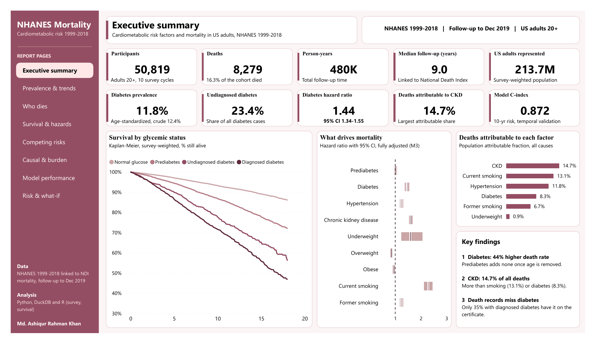
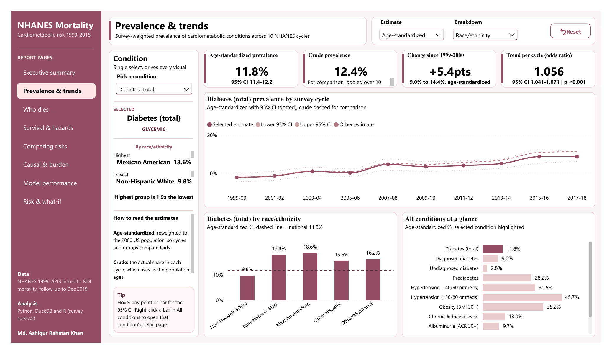
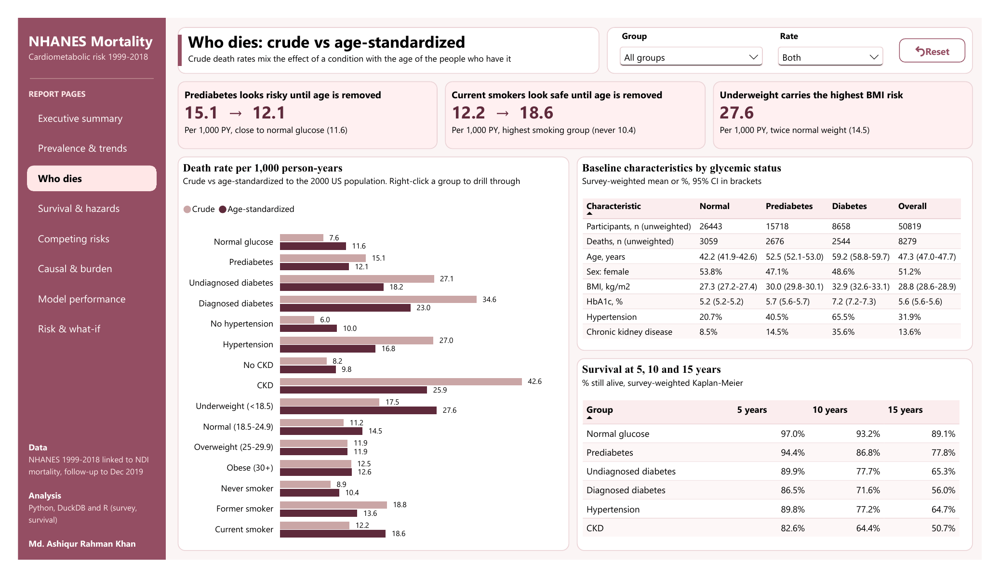
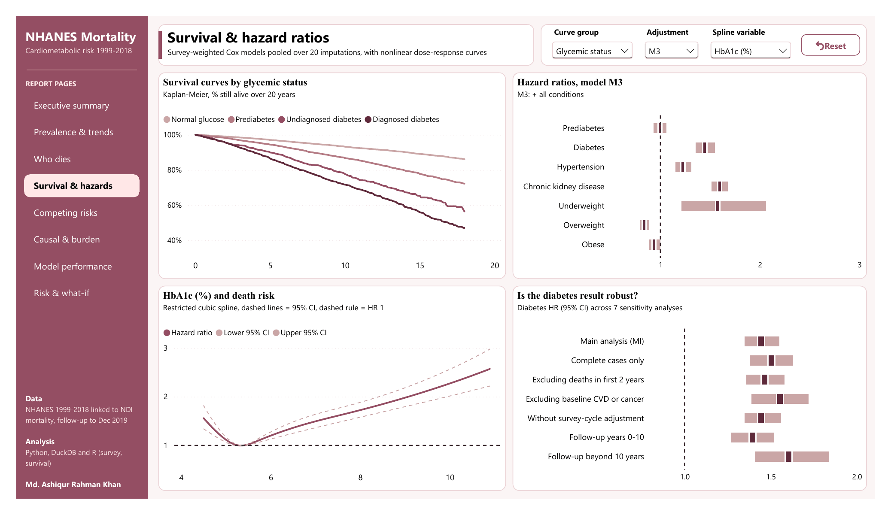
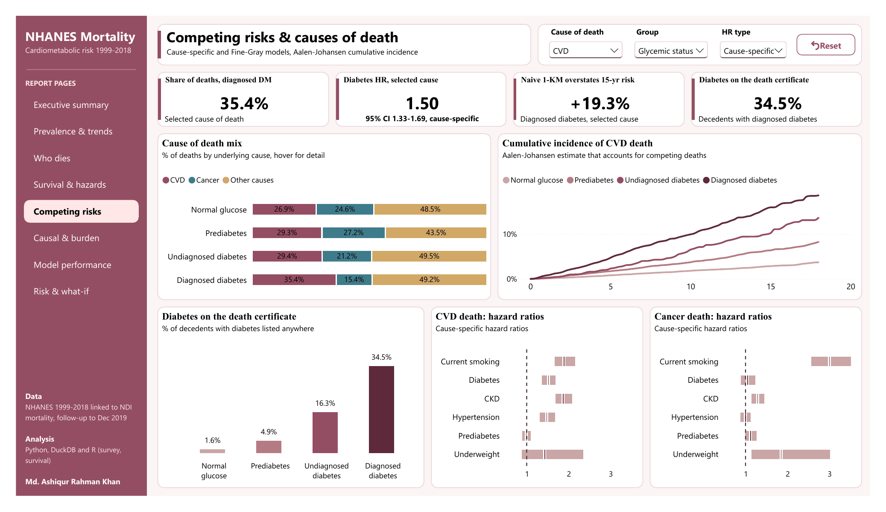
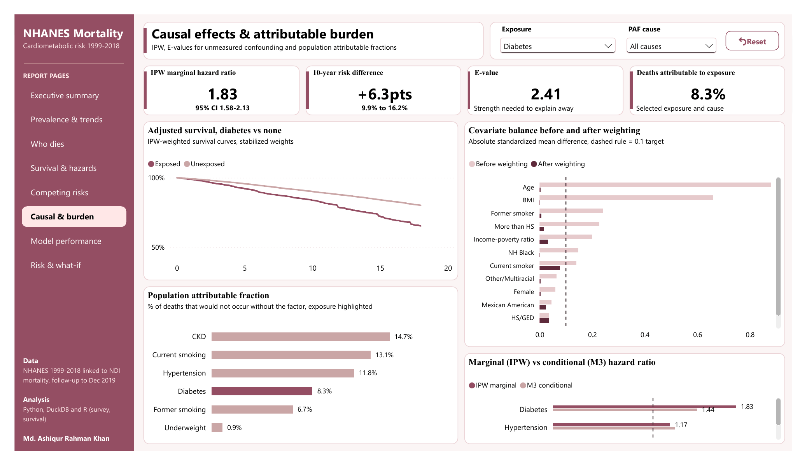
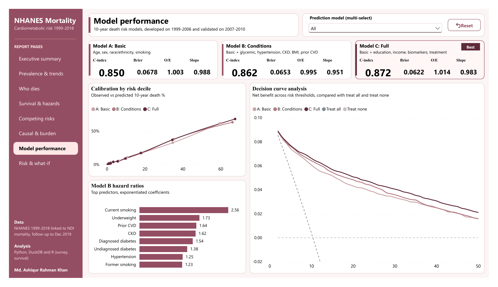
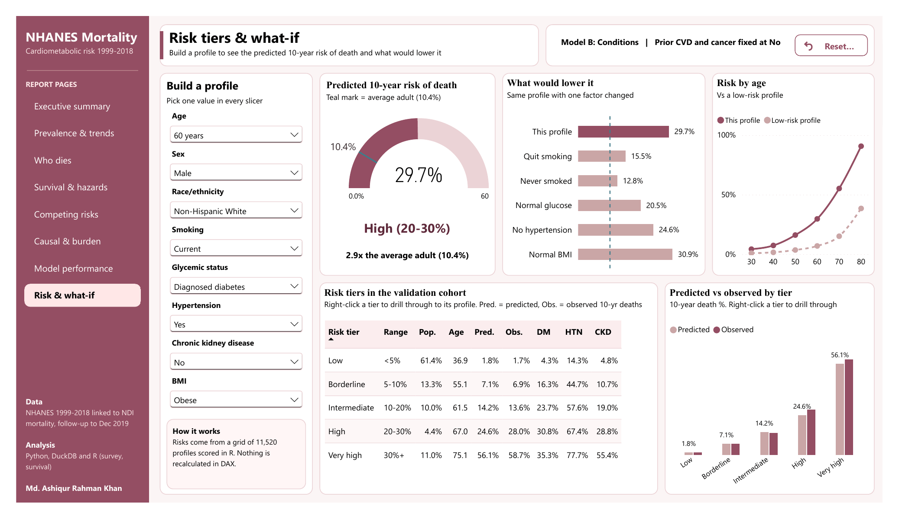
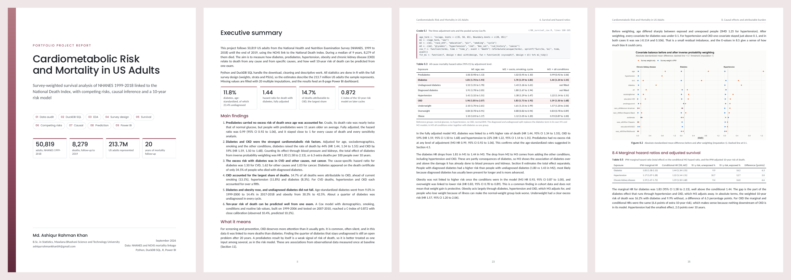

# Cardiometabolic Risk and Mortality in US Adults

Survey-weighted survival analysis of NHANES 1999-2018 linked to National Death Index mortality, with competing risks, causal inference, a 10-year risk model and a Power BI dashboard.

I followed 50,819 US adults who had a full NHANES exam between 1999 and 2018 for death up to the end of 2019. 8,279 of them died over 479,971 person-years (median follow-up 9 years, maximum 20.8). The question is simple: how much do diabetes, prediabetes, hypertension, obesity and chronic kidney disease (CKD) raise the risk of death, what do people with them die of, and how much of all death can be put down to each one.

This README is written around two things: what I found, and why I did each step the way I did. The full write-up with code, figures and tables is in [`NHANES Cardiometabolic Mortality Analysis Report.pdf`](NHANES%20Cardiometabolic%20Mortality%20Analysis%20Report.pdf).

## What I found

**1. Prediabetes looked dangerous, but the excess was age.**
The crude death rate was 19.4 per 1,000 person-years with prediabetes against 10.8 with normal glucose. After age-standardization it was 18.7 vs 19.4. Adjusting for age and sex alone brought the hazard ratio (HR) to 1.06, and the fully adjusted HR was 0.99 (0.92 to 1.06). It stayed close to 1 in all six sensitivity analyses. Prediabetes still matters as a step towards diabetes, but over this follow-up it did not raise the risk of death on its own.

**2. Crude rates hid the risk of smoking.**
Current smokers had a crude death rate of 15.9, which does not stand out. Age-standardized it was 31.9 vs 16.9 for never smokers, and the adjusted HR was 2.27 (2.09 to 2.46), the strongest single factor in the model. Smokers in the sample were younger, so the crude number made them look healthier than they were.

**3. Diabetes raises the risk of death, more so once it is diagnosed.**
Fully adjusted HR 1.44 (1.34 to 1.55). The total effect estimated with inverse probability weighting was larger, HR 1.83 (1.58 to 2.13), about 6.3 extra deaths per 100 people over 10 years, because it keeps the part of the risk that runs through hypertension and CKD. Diagnosed diabetes carried more risk than undiagnosed (HR 1.80 vs 1.43). About 23.4% of all diabetes was undiagnosed, with no real change over 20 years.

**4. CKD carries the largest share of deaths.**
HR 1.59 (1.50 to 1.68), and 14.7% of all deaths were attributable to it, more than smoking (13.1%), hypertension (11.8%) or diabetes (8.3%). Every one of the highest-risk profiles in the SQL ranking included CKD. Its effect was stronger in the first 10 years of follow-up (HR 1.72) than after (1.33).

**5. Diabetes is not only a heart disease.**
Diabetes raised CVD death (HR 1.50) and death from other causes (1.62), but not cancer death (1.03). It appeared on the death certificate of only 34.5% of people who died with diagnosed diabetes, so cause-of-death statistics alone undercount it.

**6. The usual shortcut overstates cause-specific risk.**
Treating other causes of death as censored (1 minus Kaplan-Meier) overstated the 15-year risk of a specific cause by up to 28.5% compared with the Aalen-Johansen estimator, which accounts for competing deaths.

**7. Overweight had the lowest risk, and obesity's risk runs through other conditions.**
Overweight HR 0.83 (0.78 to 0.89), underweight 1.57 (1.20 to 2.06). Obesity was 1.12 after adjusting for sociodemographics and smoking, but 0.93 once diabetes, hypertension and CKD were in the model.

**8. Diabetes became more common.**
Age-standardized diabetes prevalence was 11.8% overall, rising from 9.0% in 1999-2000 to 14.4% in 2017-2018. Hypertension 30.5%, obesity 35.2%, prediabetes 28.2%.

**9. 10-year risk of death can be predicted well, mostly from age.**
Trained on 1999-2006 and tested on 2007-2010, the full model reached a C-index of 0.872, with observed risk 10.4% vs predicted 10.2%. A basic model with only age, sex, race and smoking already reached 0.850.

HR = hazard ratio from survey-weighted Cox models, pooled over 20 imputations, 95% CI in brackets.

## Dashboard

Eight report pages, three drill-through pages and tooltip pages, built on 42 tables written by the last R script. The dashboard only looks up and formats the R results, so its numbers match the report exactly. Open [`NHANES Analysis Dashboard.pbix`](NHANES%20Analysis%20Dashboard.pbix) in Power BI Desktop, or view [`NHANES Analysis Dashboard.pdf`](NHANES%20Analysis%20Dashboard.pdf).

| | |
|---|---|
|  |  |
| Executive summary | Prevalence and trends |
|  |  |
| Who dies: crude vs age-standardized | Survival and hazard ratios |
|  |  |
| Competing risks and causes of death | Causal effects and attributable burden |
|  |  |
| Model performance | Risk tiers and what-if |

## Why I did it this way

Each step below says what I did, why, and what I decided against.

### Data and tools

**Why NHANES with linked mortality.** I wanted measured risk factors, a sample that represents the US population, and a hard outcome with long follow-up. NHANES measures HbA1c, blood pressure and kidney markers in an exam centre, so undiagnosed disease is visible. Death comes from the National Death Index, so it does not depend on anyone seeking care. I did not use CMS hospital readmission data (hospital level only, no individual risk factors) or UK Biobank (needs an application, and its volunteers are healthier than the general population).

**Why Python for the data and R for the statistics.** Python handled the download, cleaning and SQL. Every inferential number comes from R, because the `survey` package has design-based Cox models, survey standardization and Kaplan-Meier that Python does not offer. A Cox model in Python would give the right point estimate but the wrong standard errors.

### 01 Download

Fourteen NHANES components for all 10 cycles, plus the public-use Linked Mortality Files (follow-up to 31 December 2019). I stopped at 2017-2018 because the 2019-2020 cycle was cut short by COVID and is not in the 2019 linkage. File names changed before 2005 (HbA1c was `LAB10`, `L10_B`, `L10_C`, then `GHB_D`), so the code tries each candidate name per cycle and logs which one it found. The mortality columns are read with the positions from CDC's own R read-in program.

### 02 Cohort and definitions

| Choice | Why | Not used |
|---|---|---|
| Adults 20+, MEC examined, linkage-eligible, not pregnant | Labs and BP only exist for examined people, deaths can only be found for eligible people, pregnancy changes glucose and BP | Age 18+ (adult questionnaire items start at 20) |
| Follow-up from the exam date | Exposures are measured at the exam | Interview date |
| Diabetes: told, insulin, pills, HbA1c 6.5%+ or fasting glucose 126+ | ADA criteria plus self-report, catches undiagnosed cases | Self-report only (misses about a quarter) |
| Hypertension: mean SBP 140+ or DBP 90+ or on medication | Used in most NHANES mortality studies, so results compare | ACC/AHA 130/80 (kept as a secondary flag) |
| eGFR: CKD-EPI 2021 on calibrated creatinine | Current race-free standard; CDC corrections for 1999-2000 and 2005-06 assay drift | CKD-EPI 2009 (uses race), MDRD |
| CKD: eGFR below 60 or ACR 30+ mg/g | KDIGO uses both kidney function and damage | eGFR only (misses early CKD) |
| Weights: 4-year x 2/10 (1999-2002), 2-year x 1/10 after | CDC rule for combining 10 cycles | Raw weights (would count the population 10 times) |
| Extreme values kept | CDC measurements under quality control, only a handful flagged; splines limit their pull | Deleting outliers |

Every exclusion is counted in `outputs/tables/02_cohort_funnel.csv`: 101,316 participants, 55,081 aged 20+, 52,398 examined, 52,287 linkage-eligible, 50,819 not pregnant.

### 03 SQL

Eleven questions in DuckDB SQL on the Parquet cohort: risk profiles ranked by death rate, the hypertension care cascade, a KDIGO grid and a life table built with window functions. These are crude, unweighted numbers. I used them to find patterns and check the data, not to report effects, because SQL cannot apply the survey design. One example: hypertension control rose from 27% in 1999-2000 to 52% in 2013-14, then fell to 42% in 2017-18.

### 04 EDA

I set the modelling rules here, before fitting any model, so no choice was made after seeing a hazard ratio.

| What the EDA showed | What I did in R |
|---|---|
| Age explains the crude prediabetes excess and hides smoking risk | Age in every model as a spline; age-standardized rates next to crude |
| U and J shaped risk for BMI, HbA1c, SBP, eGFR, HDL | Splines and BMI groups, not straight lines |
| ACR and triglycerides strongly skewed | Log ACR |
| BMI and waist correlated 0.89, total and non-HDL cholesterol 0.91 | One of each pair (BMI, less missing) |
| People with missing values were older and died more (27.1 vs 14.7 per 1,000 person-years) | Multiple imputation, complete cases only as a check |
| Prediabetes jumped in 2007, partly a lab method change | Survey cycle in every model, plus a sensitivity run without it |

### 05 Survey design and imputation

**Survey design.** NHANES samples counties within strata and oversamples older, Black, Hispanic and low-income people. Without weights the estimates lean towards those groups, and without strata and PSUs the confidence intervals are too narrow. I used `svydesign` with PSU, strata and weights (`nest = TRUE`). All 301 PSUs are still in the cohort, so this gives the same standard errors as a full-sample domain analysis.

**Multiple imputation.** 22.1% of people missed at least one value, and they died almost twice as often, so dropping them would remove the sickest people. I used `mice` with 20 imputations: predictive mean matching for numbers, so imputed values are real observed values, and the death indicator plus the Nelson-Aalen cumulative hazard in the imputation model (White and Royston, 2009). Leaving the outcome out would pull hazard ratios towards 1. Conditions were re-derived from the imputed lab values in each dataset. Fasting glucose, triglycerides and LDL were not imputed because only the morning fasting half of the sample was tested, by design. I did not use mean imputation or a missing-indicator category (both bias the estimates) or single imputation (too-narrow intervals).

**Prevalence.** Age-standardized to the 2000 US standard population in three age groups, the same method NCHS uses in its Data Briefs, so the numbers can be checked against CDC publications. Trends were tested with survey logistic regression on cycle, adjusted for age, sex and race.

### 06 Survival and Cox models

**Why Cox.** Follow-up ranges from under a year to 20 years. Logistic regression on "died or not" would treat those the same and drop people censored early. Cox uses the timing and needs no assumption about the shape of the baseline risk.

**Why three models.** M1 adjusts for age and sex, M2 adds race, education, income, smoking and survey cycle, M3 adds all the conditions together plus prior CVD and cancer. Watching a hazard ratio move shows what explains it: diabetes went 1.81, 1.70, 1.44, while prediabetes was already 1.06 at M1.

**Time scale.** Time since the exam, with age as a natural spline (knots 35, 50, 65). Age as the time scale is the other common choice; with flexible age adjustment the two give very similar results, and time since exam makes the survival curves and 10-year risk easier to read.

**Splines.** Dose-response curves for HbA1c, BMI, SBP, eGFR, HDL and ACR. Lowest risk sat at HbA1c 5.3%, BMI 26.5, SBP 117 and HDL 59.

**Proportional hazards.** The Schoenfeld test was significant, as it usually is with 50,000 people. I checked whether it mattered by splitting follow-up at 10 years. The conclusions held; CKD was stronger early, diabetes slightly stronger late. Both periods are reported.

**Sensitivity analyses.**

| Analysis | Diabetes | Prediabetes | CKD | Hypertension |
|---|---|---|---|---|
| Main (20 imputations) | 1.44 | 0.99 | 1.59 | 1.22 |
| Complete cases (n = 39,607) | 1.50 | 1.03 | 1.59 | 1.24 |
| Excluding deaths in first 2 years | 1.46 | 0.99 | 1.53 | 1.25 |
| Excluding baseline CVD or cancer | 1.55 | 1.01 | 1.60 | 1.28 |
| Without survey cycle | 1.44 | 0.99 | 1.59 | 1.22 |
| Follow-up 0 to 10 years | 1.39 | 0.96 | 1.72 | 1.20 |
| Follow-up after 10 years | 1.60 | 1.05 | 1.33 | 1.25 |

### 07 Competing risks

Someone who dies of cancer can no longer die of CVD. Treating those deaths as if the person just left the study overstates cause-specific risk, by up to 28.5% here. So I used the Aalen-Johansen estimator for absolute risk, cause-specific Cox models for the main hazard ratios (does the condition speed up death from this cause), and Fine-Gray models as a check (how it changes the real-world chance of dying from this cause). Reporting both kinds of hazard ratio is the current recommendation, because they answer different questions. Fine-Gray expands the data a lot, so on my laptop I rounded follow-up to quarter-years (hazard ratios unchanged to three decimals) and used 5 of the 20 imputations.

### 08 Causal inference and attributable burden

**Confounders, not mediators.** Each exposure got its own adjustment set. Diabetes was not adjusted for hypertension or CKD, because diabetes causes them, and adjusting for them would hide part of its effect. That is why the IPW diabetes HR (1.83) is larger than the M3 HR (1.44).

**Inverse probability weighting.** Propensity scores from survey-weighted logistic models, stabilized weights multiplied by the survey weight. Balance after weighting: largest standardized mean difference 0.077 for diabetes, 0.114 for hypertension, 0.106 for CKD.

**No weight truncation.** I tested cutting 0.1%, 0.5% and 1% of extreme weights. For diabetes, truncation made age balance worse (largest difference up to 0.32) and pushed the HR up to 2.28. The untruncated weights stayed moderate, so I kept them. I chose by balance, not by which HR looked better.

**E-values.** A hidden confounder would need a risk ratio of 2.41 with both diabetes and death, beyond everything adjusted for, to explain away the diabetes effect. For smoking it is 2.91.

**Attributable fractions.** Miettinen's formula, which is correct with adjusted hazard ratios. Levin's formula is not. The fractions overlap and do not add up: one death can count towards diabetes, hypertension and CKD at once.

I did not use propensity score matching (it drops unmatched people and makes survey weights hard to keep) or TMLE (survey-weighted survival versions are not mature in R yet).

### 09 Risk prediction

**Temporal split.** Developed on 1999-2006 (17,869 people), validated on 2007-2010 (11,621). A random split tests the model on people from the same years. Testing on later cycles checks whether it still works after treatment and the population changed. Survey cycle is never a predictor, because a model used today cannot know it.

**Three models.** A: age, sex, race, smoking. B: A plus the conditions a clinic already records. C: A plus income, education and lab values as splines.

| Model | C-index | Observed / expected | Calibration slope |
|---|---|---|---|
| A: Basic | 0.850 | 1.003 | 0.988 |
| B: Conditions | 0.862 | 0.995 | 0.951 |
| C: Full | 0.872 | 1.014 | 0.983 |

I reported calibration and decision curves next to the C-index, because a risk number shown to a person has to be right in size, not just in order. I stayed with Cox rather than random survival forests or boosting: on this kind of data they rarely beat Cox, and they are harder to calibrate and to pool over 20 imputations. Model B powers the what-if tool on the dashboard, because a user knows whether they have diabetes but not their ACR.

### Power BI

The last R script writes 42 tables in a star schema. Power BI only displays them. Survey-weighted, imputation-pooled estimates cannot be rebuilt from rows in DAX, so recomputing them there would show different, wrong numbers.

## Files

| Step | Tool | File |
|---|---|---|
| 01 | Python | [`01_download_nhanes_mortality.ipynb`](notebooks/01_download_nhanes_mortality.ipynb) |
| 02 | Python | [`02_data_audit.ipynb`](notebooks/02_data_audit.ipynb) |
| 03 | Python, SQL | [`03_duckdb_sql.ipynb`](notebooks/03_duckdb_sql.ipynb) |
| 04 | Python | [`04_eda.ipynb`](notebooks/04_eda.ipynb) |
| 05 | R | [`05_survey_design_imputation.R`](r/05_survey_design_imputation.R) |
| 06 | R | [`06_survival_cox.R`](r/06_survival_cox.R) |
| 07 | R | [`07_competing_risks.R`](r/07_competing_risks.R) |
| 08 | R | [`08_causal_attributable.R`](r/08_causal_attributable.R) |
| 09 | R | [`09_risk_prediction_powerbi.R`](r/09_risk_prediction_powerbi.R) |

## Report

50 pages: executive summary, then one section per notebook or script with the code, figures and result tables, then discussion, limitations and references. Every number in the text comes from the output CSVs.



## Limitations

- Every exposure is measured once, at the exam. Changes over follow-up are not seen, which usually pulls hazard ratios towards 1.
- Diabetes rests on a single HbA1c or fasting glucose value, not a repeat test.
- The HbA1c lab method changed in 2007-2008, which explains part of the rise in prediabetes. Survey cycle is in every model.
- Prior CVD, cancer and smoking are self-reported.
- NCHS perturbs the follow-up time and cause of death for some records in the public-use mortality files.
- Physical activity, diet and access to care are not measured. The E-values show how strong a hidden confounder would need to be.
- Hazard ratios are associations from observational data. The IPW estimates and attributable fractions assume no unmeasured confounding.
- Hypertension and CKD balance after weighting was slightly above the usual 0.1 threshold.
- The risk model is validated on later NHANES cycles, not on a separate cohort.

## Project structure

```
NHANES Cardiometabolic Mortality Project/
├── data/
│   ├── raw/                download_manifest.csv (raw .xpt and .dat files not in the repo)
│   ├── parquet/            one Parquet file per NHANES component, plus mortality
│   └── processed/          analytic_cohort.parquet (50,819 rows x 58 columns)
├── notebooks/              01 to 04, Python (Google Colab)
├── r/                      05 to 09, R scripts (RStudio)
├── outputs/
│   ├── sql_results/        q01 to q11
│   ├── tables/             02_* and 04_* tables
│   ├── figures/            04_* figures
│   ├── R/                  one folder per R script with its CSVs, figures and session info
│   └── powerbi/            42 tables, _relationships.csv, _table_dictionary.csv
├── images/                 README screenshots
├── NHANES Cardiometabolic Mortality Analysis Report.pdf
├── NHANES Analysis Dashboard.pbix
├── NHANES Analysis Dashboard.pdf
└── requirements.txt
```

## How to run

**What is not in the repo.** The raw CDC files (`data/raw/nhanes`, `data/raw/mortality`, about 260 MB) and the R `.rds` files (imputed data and model caches, about 65 MB) are left out. The Parquet files and the analytic cohort are included, so notebooks 02 to 04 and all R scripts run without downloading anything.

**Python (notebooks 01 to 04).**

1. In Google Colab: copy the folder to `MyDrive/NHANES Cardiometabolic Mortality Project` and run the notebooks in order. The first cell mounts Drive.
2. Locally: `pip install -r requirements.txt`, then run the notebooks from inside `notebooks/`. The first cell falls back to the parent folder when it is not in Colab.
3. Notebook 01 needs internet access to `wwwn.cdc.gov` and `ftp.cdc.gov`. Skip it unless you want to rebuild `data/raw` and `data/parquet`.

**R (scripts 05 to 09).**

1. R 4.5 with `tidyverse`, `arrow`, `survey`, `mitools`, `mice` and `survival` installed.
2. Change `root` at the top of each script to your project path.
3. Run 05 to 09 in order. Each script reads the outputs of the ones before it and saves into its own folder under `outputs/R/`.
4. The first run takes time: the imputation in 05 (10 to 30 minutes), about 440 Cox fits in 06 (10 to 20 minutes) and the Fine-Gray models in 07. Slow steps are cached in `.rds` files, so a rerun picks up where it stopped. The imputation seed is 2026.

**Power BI.** The data is embedded in the `.pbix`. To refresh from the CSVs, change the `DataFolder` parameter to your `outputs/powerbi` path.

## Data

- Centers for Disease Control and Prevention, National Center for Health Statistics. [National Health and Nutrition Examination Survey](https://wwwn.cdc.gov/nchs/nhanes/), 1999-2018.
- National Center for Health Statistics. [Public-use Linked Mortality Files](https://www.cdc.gov/nchs/data-linkage/mortality-public.htm), follow-up to 31 December 2019.

Both are public-use files, freely available from CDC/NCHS.

## Author

**Md. Ashiqur Rahman Khan**, B.Sc. in Statistics, Mawlana Bhashani Science and Technology University

[LinkedIn](https://www.linkedin.com/in/md-ashiqur-rahman-khan-b475b1316/) · ashiqurrahmankhan04@gmail.com
